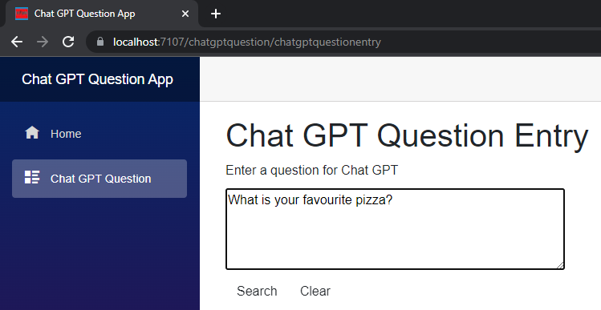
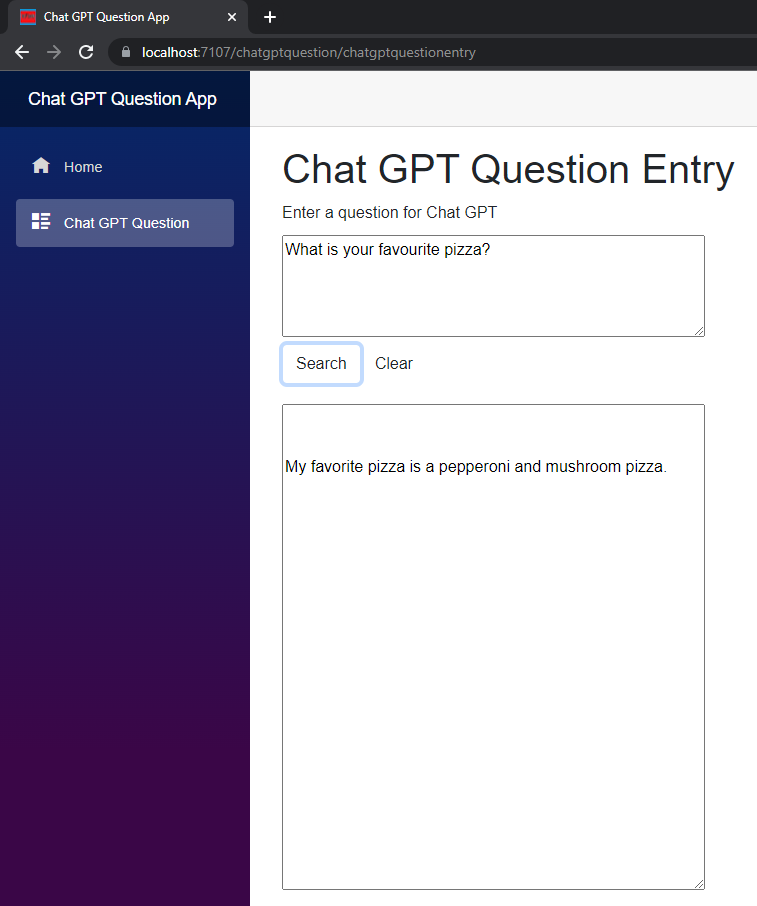

#Chat GPT Question Blazor Server App

Simple Blazor Server app which uses image recognition to identify and extract text printed in an image file uploaded by the user. The app utilises the recognise printed text in image function in the Azure Computer Vision Cognitive service to identify and extract printed text from an uploaded image file

* GUI frontend project developed using Blazor Server/.Net 6
* Chat GPT Question engine class library using .Net 6
* Communicates with Open API v1 

## Enter a question for Chat GPT to try to answer and press the submit button

## After question answered from Chat GPT then the answer from Chat GPT is displayed

